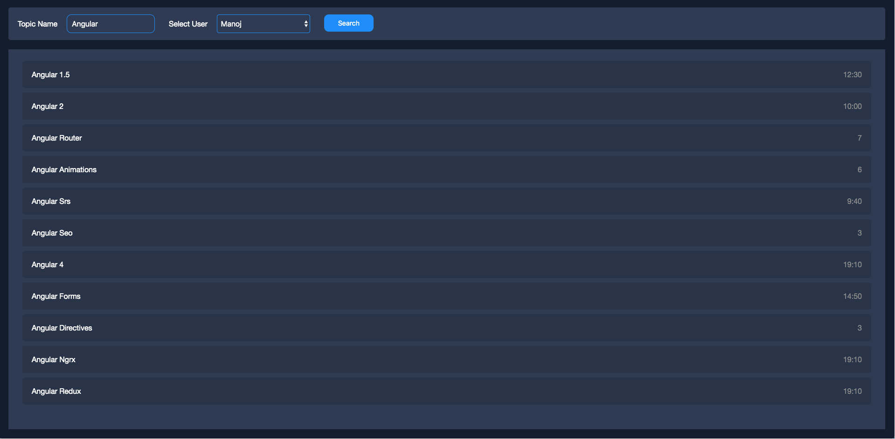
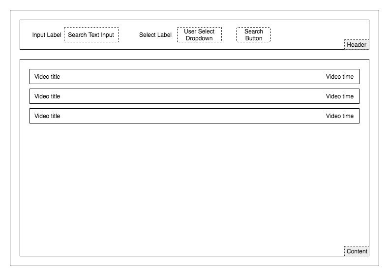
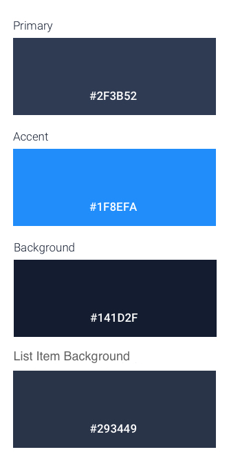

# InterviewApp
Natella Peretz 
Build playlist search app

1. Logic part - **_Do this part First!_**
    1. Header Section - User can type any text (such as Angular, React, CSS, Flexbox...) and select a user from the users list.
        1. Use ReactiveForms (relevant only to Angular)
        1. Add Form Validation - Search button should be disabled if form is not valid.
        1. Clicking the Search button should populate the Results Section
    1. Results Section - Display the selected user's playlist
        1. Show only the videos that include the text typed into the text input
1. Style part
    1. Do **not** use any UI/Component library - Only CSS (or SCSS)
    1. Style the Header, Content and List items first and after that the inputs and labels.
    1. Colors variables are available under `src/styles/colors.scss` and are already imported in `app.component.scss`

## MainScreen

### Example

### Wireframe

## Colors

* `scss` variables available under `src/styles/colors.scss`

## Prerequisites

1. NodeJS version `^12.14.1 || ^14.0.0`

## Usage

1. Change directory using `cd angular`
1. Install Dependencies: `npm install`
1. Install Server Dependencies: `npm run install-server`
1. Start Server: `npm run start-server`
1. Serve project: `npm start` 
n